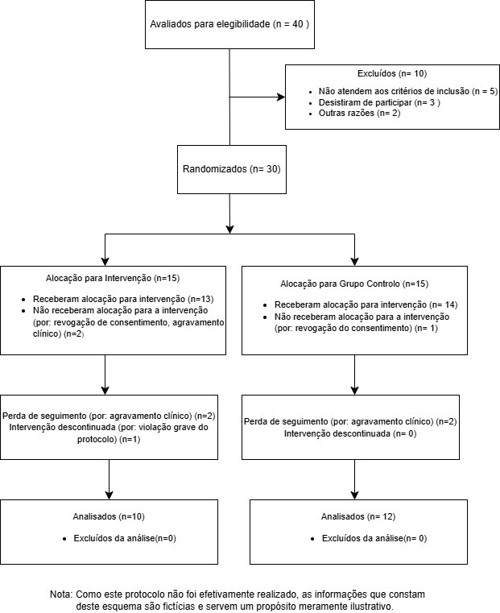

## Resumo do Protocolo

Nesta página apresentamos a estrutura clínica e metodológica do ensaio **MindMove**.

::: callout-tip
## Material Disponível para download

**Documento Completo:** (documento integral com todas as referências bibliográficas): [Descarregar o Protocolo (PDF)](ficheiros/protocolodolatex.pdf).
:::

------------------------------------------------------------------------

## 1. Introdução e Racional

A transição para o ensino superior é um período de vulnerabilidade crítica. O MindMove visa preencher a lacuna de suporte em saúde mental, oferecendo uma solução digital (mHealth) baseada em Terapia Cognitivo-Comportamental digital (dCBT) com monitorização de estilos de vida (sono e atividade física) para estudantes universitários com sintomas depressivos ligeiros a moderados (PHQ-9 entre 5-14).

### Objetivos Principais

-   **Primário:** Avaliar a eficácia da app na redução dos sintomas depressivos (escala PHQ-9) ao fim de 8 semanas, face a um grupo de controlo.
-   **Secundários:** Avaliar ansiedade (GAD-7), qualidade do sono (PSQI), atividade física, viabilidade, adesão e usabilidade (SUS).

------------------------------------------------------------------------

## 2. Métodos e Desenho do Estudo

O estudo configura-se como um ensaio clínico controlado e randomizado (RCT), de grupos paralelos (1:1), com 30 participantes, a realizar no Serviço de Psicologia da Universidade do Porto. A duração da intervenção é de 8 semanas.

### Critérios de Inclusão (Resumo)

-   Idade 18-30 anos, estudantes universitários ativos.
-   PHQ-9 entre 5 e 14 (sintomas ligeiros a moderados).
-   Posse de smartphone com internet e capacidade para usar a app.

### Critérios de Exclusão (Resumo)

-   Diagnóstico de Depressão Major ou patologias graves.
-   Toma atual de antidepressivos ou ideação suicida ativa (PHQ-9 item 9 $\ge$ 1).

------------------------------------------------------------------------

## 3. Intervenções

### Grupo de Intervenção (App MindMove)

Os participantes utilizam a aplicação para:

-   **Monitorização Ativa:** Registo diário de humor e sinais vitais.
-   **Sistema de Alertas:** Feedback e notificações em tempo real.
-   **Conteúdo educativo:** Guias de gestão de saúde mental.

### Grupo Controlo (Standard of Care)

Acompanhamento clínico convencional do SNS e entrega de um folheto informativo em papel com recomendações gerais no início do estudo.

------------------------------------------------------------------------

## 4. Fluxo esperado do Estudo

*(Abaixo encontra-se a progressão esperada dos participantes no ensaio)*

| Fase | Duração | Descrição |
|:-----------------------|:-----------------------|:-----------------------|
| **Recrutamento** | Semanas -2 a 0 | Divulgação digital e física; triagem online (Informed Consent + PHQ-9). |
| **Baseline (T0)** | Dia 0 | Avaliação completa (PHQ-9, GAD-7, PSQI); Randomização automatizada. |
| **Intervenção** | Semanas 1-8 | **Grupo I:** Uso da App MindMove (protocolo 3x/semana). **Grupo C:** Acesso a brochuras PDF sobre higiene do sono e saúde mental. |
| **Mid-term (T1)** | Semana 4 | Avaliação intermédia de segurança, adesão e sintomas (PHQ-9). |
| **Post-test (T2)** | Semana 8 | Avaliação final de todos os outcomes primários e secundários. |
| **Follow-up** | Semana 12 | (Opcional) Avaliação de manutenção de ganhos após término da intervenção. |

------------------------------------------------------------------------

## 5. Ética e Segurança

O protocolo garante total conformidade com o RGPD (dados encriptados e anonimizados) e inclui um **Protocolo de Resgate**: se um participante pontuar ideação suicida ou agravamento severo, a equipa clínica recebe um alerta imediato para contacto em 24 horas.
